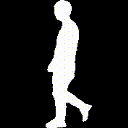

    
    
    

------------------------------------------

# Project based on OpenGait Trained by wqkang

This project is based on the OpenGait framework and has been trained by wqkang. For communication, please reach out to wenqiaokang@outlook.com. Project affiliation: NCWU.

## What's New
- **[Dec 2023]** A new state-of-the-art baseline, i.e., [DeepGaitV2](https://arxiv.org/pdf/2303.03301.pdf), is available at [here](https://github.com/ShiqiYu/OpenGait/blob/master/opengait/modeling/models/deepgaitv2.py)!
- **[Nov 2023]** The first million-level unlabeled gait dataset, i.e., [GaitLU-1M](https://ieeexplore.ieee.org/document/10242019), is released and supported in [datasets/GaitLU-1M](datasets/GaitLU-1M/README.md).
- ...

<!-- Your additional content can go here -->

## Contact Information
For communication and inquiries, please contact:
- Name: wqkang
- Email: wenqiaokang@outlook.com
- Affiliation: NCWU

<!-- The rest of the README file remains unchanged -->
